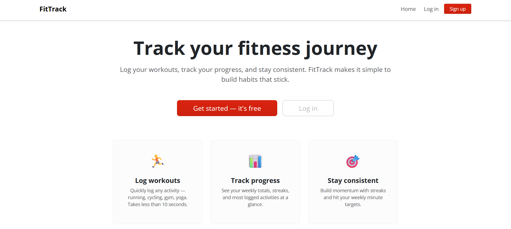
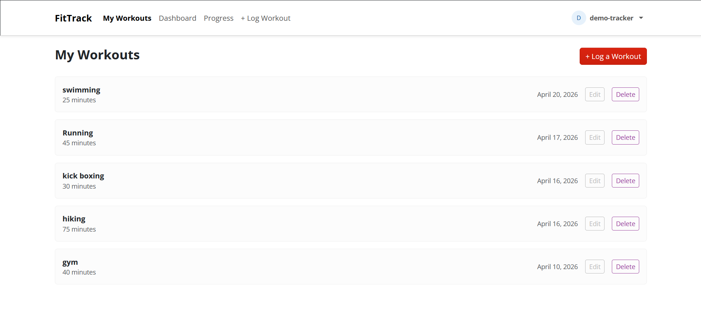
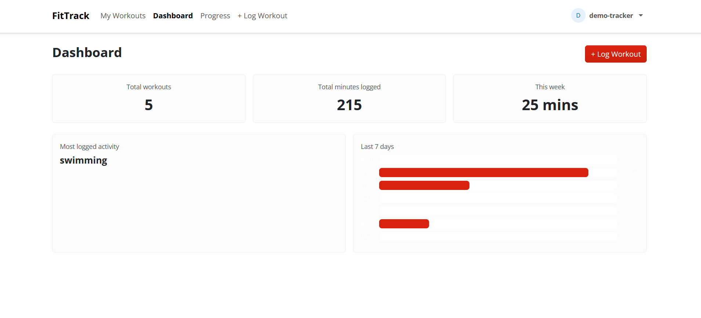
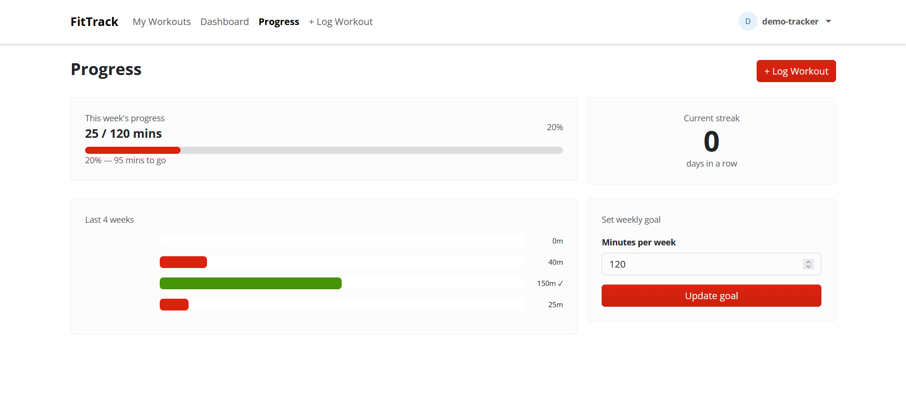
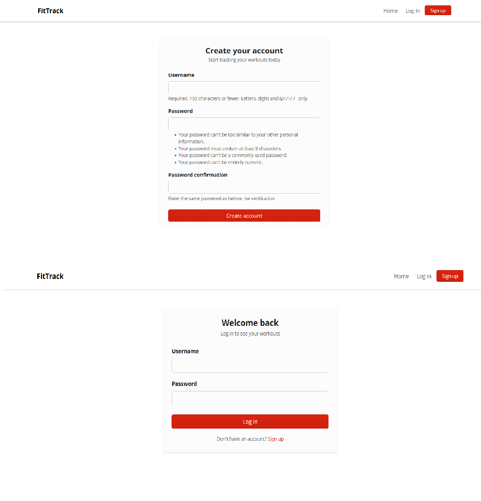

# FitTrack Web App 🏃

A full-stack fitness tracking web app built with Python Django and Bootstrap 5.

It's a fitness tracker where users can sign up, log their workouts, and monitor
their progress over time — with a dashboard, weekly goals, and streak tracking.

🔗 **Live app:** https://web-production-5fc12.up.railway.app

---

## App Preview

### Home



### My Workouts



### Dashboard



### Progress



### Login & Register

## 

## Features

- 🔐 User authentication (register, login, logout)
- 📝 Log workouts (activity, duration, date)
- ✏️ Edit and delete workouts
- 📊 Dashboard with stats and charts
- 🎯 Progress tracking with weekly goals
- 🔥 Streak counter
- 📱 Responsive design with Bootstrap 5

---

## Tech Stack

| Layer                 | Technology  |
| --------------------- | ----------- |
| Language              | Python 3.13 |
| Framework             | Django 5.2  |
| Database (local)      | SQLite      |
| Database (production) | PostgreSQL  |
| Frontend              | Bootstrap 5 |
| Web server            | Gunicorn    |
| Static files          | Whitenoise  |
| Deployment            | Railway     |
| Version control       | GitHub      |

---

## Architecture

```
Request → Gunicorn → Django URLs → View → Model (ORM) → PostgreSQL
                                      ↓
                                 Template → Bootstrap → Response
```

fitness-tracker/
│
├── fitness_project/ → project configuration
│ ├── settings.py → environment-aware settings
│ ├── urls.py → root URL configuration
│ └── wsgi.py → WSGI entry point
│
├── tracker/ → main application
│ ├── migrations/ → database migration files
│ ├── templates/
│ │ └── tracker/
│ │ ├── base.html → master template with navbar
│ │ ├── home.html → public landing page
│ │ ├── login.html → login page
│ │ ├── register.html → registration page
│ │ ├── workout_list.html → view all workouts
│ │ ├── add_workout.html → log a workout
│ │ ├── edit_workout.html → edit a workout
│ │ ├── delete_workout.html → delete confirmation
│ │ ├── dashboard.html → stats and charts
│ │ └── progress.html → goals and streak
│ ├── models.py → Workout, UserProfile models
│ ├── views.py → all views and business logic
│ ├── urls.py → app-level URL patterns
│ ├── forms.py → ModelForms with Bootstrap styling
│ └── admin.py → Django admin registration
│
├── .env → local secrets (not committed)
├── .gitignore → ignored files
├── Procfile → Railway start command
├── railway.toml → Railway build and deploy config
├── requirements.txt → Python dependencies
└── README.md

---

## Data Models

User (Django built-in)
├── Workout
│ ├── user (ForeignKey → User)
│ ├── activity (CharField)
│ ├── duration (IntegerField)
│ └── date (DateField)
│
└── UserProfile
├── user (OneToOneField → User)
└── weekly_goal (IntegerField)

---

## Local Setup

**1. Clone the repo**

```bash
git clone https://github.com/Muskan-Khorasi/fitness-tracker-web-app.git
cd fitness-tracker
```

**2. Create and activate virtual environment**

```bash
# Windows
python -m venv venv
venv\Scripts\activate

# Mac / Linux
python3 -m venv venv
source venv/bin/activate
```

**3. Install dependencies**

```bash
pip install -r requirements.txt
```

**4. Create `.env` file in the project root**

SECRET_KEY=your-secret-key-here
DEBUG=True
ALLOWED_HOSTS=localhost,127.0.0.1

**5. Run migrations**

```bash
python manage.py migrate
```

**6. Create a superuser (optional — for admin panel)**

```bash
python manage.py createsuperuser
```

**7. Start the Local development server**

```bash
python manage.py runserver
```

**8. Visit** `http://127.0.0.1:8000`

---

## Deployment

This app is deployed on **Railway** with the following setup:

- PostgreSQL database provisioned directly on Railway
- Environment variables set via Railway dashboard
- `railway.toml` handles `collectstatic`, `migrate`, and server start automatically on every deploy
- Auto-deploys on every push to the `main` branch on GitHub

**Environment variables required on Railway:**

| Variable        | Description                  |
| --------------- | ---------------------------- |
| `SECRET_KEY`    | Django secret key            |
| `DEBUG`         | Set to `False` in production |
| `ALLOWED_HOSTS` | Railway domain               |
| `PGDATABASE`    | Auto-set by Railway Postgres |
| `PGUSER`        | Auto-set by Railway Postgres |
| `PGPASSWORD`    | Auto-set by Railway Postgres |
| `PGHOST`        | Auto-set by Railway Postgres |
| `PGPORT`        | Auto-set by Railway Postgres |

---

## Security

- Passwords hashed using Django's built-in PBKDF2 algorithm
- CSRF protection on all forms
- `@login_required` on all protected views
- `get_object_or_404` with user filtering prevents accessing other users' data
- Secret key and database credentials stored in environment variables
- `DEBUG=False` in production
- `ALLOWED_HOSTS` restricted to Railway domain

## What I learned

Building this end to end — from models to deployment — taught me more than any isolated exercise could. Key takeaways:

- How Django's MVT architecture actually works in practice
- Building user authentication from scratch using Django's built-in auth system
- Database models and migrations
- Linking models with ForeignKey and OneToOneField relationships
- Using the ORM for real queries — filtering, aggregating, annotating for stats
- Template inheritance and why base.html matters
- The difference between development and production environments
- Securing secrets with environment variables
- Deploying a Django app with Gunicorn, Whitenoise, and PostgreSQL on Railway

## What's next

- [ ] Interactive dashboard charts with Chart.js — richer visuals and monthly trends
- [ ] Natural language workout logging using AI — type "ran 5km for 40 minutes" and the form fills itself
- [ ] Voice input — speak your workout and let AI parse and log it automatically
- [ ] Automated weekly email reports summarising your workout activity
- [ ] REST API with Django REST Framework — foundation for a future mobile app
